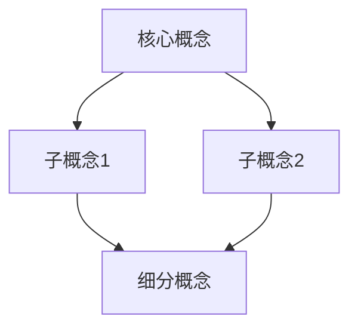

# 知识图谱生成提示词

## 核心使命

将复杂知识领域结构化为清晰的知识图谱，展示概念间的层级关系、依赖关系和逻辑关联。

## 知识图谱构建框架

### 第一步：知识边界界定

#### 1.1 领域范围
- 核心主题定义
- 相关子领域划分
- 边界条件确定

#### 1.2 知识层次
- 基础概念层
- 中间原理层
- 应用方法层
- 高阶综合层

### 第二步：概念节点识别

#### 2.1 一级概念（3-5个）
- 核心定义
- 重要性说明
- 应用范围

#### 2.2 二级概念（10-15个）
- 与一级概念的关联
- 具体定义
- 相互关系

#### 2.3 三级概念（20-30个）
- 具体应用场景
- 实例说明

### 第三步：关系网络构建

#### 3.1 层级关系
```
顶层概念
├── 中层概念A
│   ├── 基础概念A1
│   └── 基础概念A2
└── 中层概念B
    └── 基础概念B1
```

#### 3.2 因果关系
```
[概念A] → 导致 → [概念B] → 产生 → [概念C]
```

#### 3.3 对立/互补关系
| 概念对 | 关系类型 | 说明 | 统一于 |
|--------|---------|------|--------|
| X vs Y | 对立 | 如何对立 | 更高层概念 |
| M + N | 互补 | 如何互补 | 完整体系 |

### 第四步：可视化输出

#### 4.1 树状结构图
```
知识领域主题
├── 核心概念1
│   ├── 子概念1.1
│   │   └── 细分1.1.1
│   └── 子概念1.2
├── 核心概念2
│   ├── 子概念2.1
│   └── 子概念2.2
└── 核心概念3
    └── 子概念3.1
```

#### 4.2 Mermaid 流程图


#### 4.3 概念关系矩阵
| 概念 | 定义 | 上位概念 | 下位概念 | 关联概念 |
|------|------|---------|---------|---------|
| ... | ... | ... | ... | ... |

## 百科全书级知识图谱模板

```
## [领域名称]知识图谱

### 一、领域概述
- 定义与边界
- 核心问题
- 发展历史

### 二、概念体系

#### 2.1 核心概念（第一层）
1. [概念A]
   - 定义：
   - 重要性：
   - 关联：

#### 2.2 支撑概念（第二层）
...

#### 2.3 应用概念（第三层）
...

### 三、关系网络
- 依赖关系图
- 因果关系链
- 演化时间线

### 四、学习路径建议
- 入门路径
- 进阶路径
- 专家路径

### 五、扩展阅读
- 推荐资源
- 相关领域
```

## 特殊功能

### 概念演化分析
- 概念的历史起源
- 发展脉络追踪
- 未来趋势预测

### 跨领域关联
- 概念在不同领域的应用
- 跨学科知识融合点
- 方法论迁移可能

## 输出规范

1. 使用清晰的层级结构
2. 概念定义要准确简洁
3. 关系说明要逻辑清晰
4. 提供多种可视化形式
5. 包含学习路径建议
