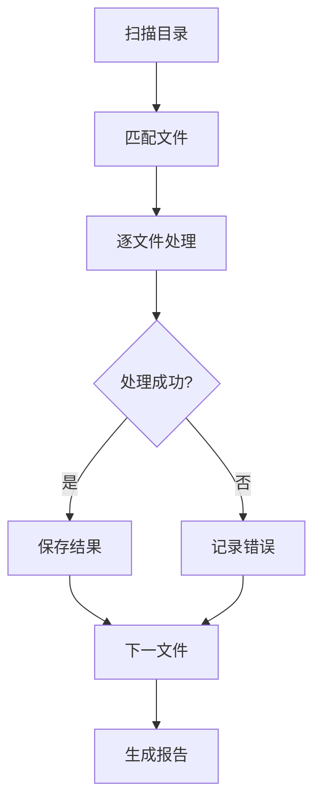

# 批量处理参考文档

## 概述

批量处理功能用于对多个文档执行统一操作，支持格式化、校对、摘要等任务。

## 支持任务

| 任务类型 | 说明 | 参数值 |
|---------|------|--------|
| **format** | 格式标准化 | 空格规范、中英文间隔 |
| **proofread** | 文档校对 | 错别字修正 |
| **summarize** | 生成摘要 | 提取标题和首段 |
| **convert** | 格式转换 | 文件格式转换 |

## 文件匹配

### 模式示例
```bash
*.md          # 所有Markdown文件
*.txt         # 所有文本文件
report_*.md   # 以report_开头的MD
**/*.md       # 递归匹配所有MD
```

## 处理流程



## 输出结构

```
output_dir/
├── file1.md          # 处理后的文件
├── file2.md
├── ...
└── _batch_report.md  # 处理报告
```

## 处理报告格式

```markdown
# 批量处理报告

**处理时间**: 2024-01-15 14:30:00
**处理任务**: format
**文件总数**: 10

## 统计
- ✅ 成功: 9
- ❌ 失败: 1

## 详细结果
| 文件 | 状态 | 原大小 | 处理后 |
|------|------|--------|--------|
| doc1.md | ✅ | 1024 | 1050 |
| doc2.md | ❌ | 512 | - |
```

## Python 脚本使用

```bash
# 格式化目录下所有MD文件
python scripts/batch_process.py -i ./docs -t format -o ./output

# 递归处理
python scripts/batch_process.py -i ./docs -t proofread -r

# 指定文件模式
python scripts/batch_process.py -i ./docs -t summarize -p "*.txt"

# 预览模式（不实际处理）
python scripts/batch_process.py -i ./docs -t format --dry-run
```

## 质量标准

- ✅ 所有文件处理完成
- ✅ 输出格式统一
- ✅ 生成处理报告
- ✅ 错误明确记录
