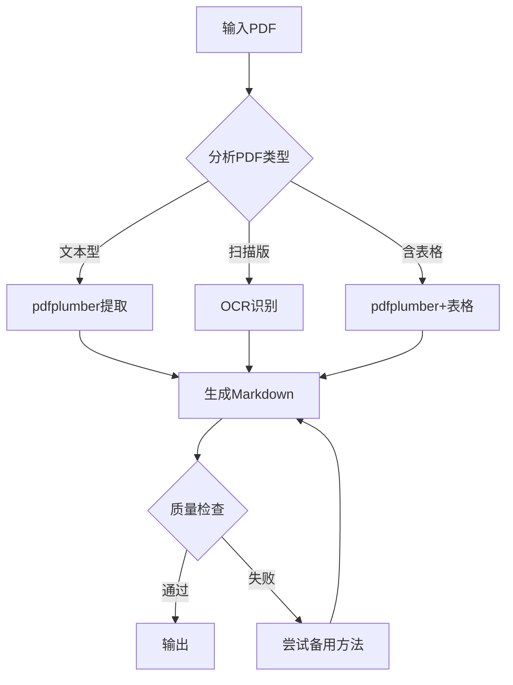

# PDF智能转换系统 v2.0

> 基于 [Anthropic官方PDF技能](https://github.com/anthropics/skills/tree/main/skills/pdf) 最佳实践

## 概述

本系统整合多种专业工具，实现PDF到Markdown的高质量转换：

| 工具 | 用途 | 许可证 |
|------|------|--------|
| **pdfplumber** | 文本+表格提取（推荐） | MIT |
| **pypdf** | 基础PDF操作 | BSD |
| **pypdfium2** | 高速渲染（Chromium内核） | Apache/BSD |
| **pytesseract** | OCR扫描件识别 | Apache |
| **pdf2image** | PDF转图像 | MIT |

---

## 快速开始

### 安装依赖

```bash
# Python库
pip install pypdf pdfplumber pypdfium2 pytesseract pdf2image pillow

# 系统依赖 (macOS)
brew install poppler tesseract tesseract-lang

# 系统依赖 (Ubuntu)
sudo apt-get install poppler-utils tesseract-ocr tesseract-ocr-chi-sim
```

### 基础使用

```bash
# 自动选择最佳方法
python scripts/pdf_converter.py --input document.pdf --output output.md

# 扫描版PDF (使用OCR)
python scripts/pdf_converter.py --input scanned.pdf --output output.md --ocr

# 提取表格
python scripts/pdf_converter.py --input document.pdf --output output.md --tables

# 同时渲染图像
python scripts/pdf_converter.py --input document.pdf --output output.md --images
```

---

## 处理策略

### 自动检测流程



### 方法选择指南

| PDF类型 | 特征 | 推荐方法 | 预期质量 |
|---------|------|---------|---------|
| **文本型** | 可复制文字 | pdfplumber | ⭐⭐⭐⭐⭐ |
| **扫描版** | 图像化页面 | OCR | ⭐⭐⭐ |
| **混合型** | 部分图像 | pdfplumber + OCR | ⭐⭐⭐⭐ |
| **含表格** | 结构化数据 | pdfplumber.extract_tables() | ⭐⭐⭐⭐ |
| **数学公式** | LaTeX公式 | Mathpix Snip | ⭐⭐⭐⭐⭐ |

---

## 核心API

### 1. 文本提取 (pdfplumber)

```python
import pdfplumber

with pdfplumber.open("document.pdf") as pdf:
    for page in pdf.pages:
        text = page.extract_text()
        print(text)
```

### 2. 表格提取

```python
import pdfplumber
import pandas as pd

with pdfplumber.open("document.pdf") as pdf:
    for page in pdf.pages:
        tables = page.extract_tables()
        for table in tables:
            df = pd.DataFrame(table[1:], columns=table[0])
            print(df.to_markdown())
```

### 3. 扫描版OCR

```python
import pytesseract
from pdf2image import convert_from_path

images = convert_from_path('scanned.pdf', dpi=300)
for i, img in enumerate(images):
    text = pytesseract.image_to_string(img, lang='chi_sim+eng')
    print(f"Page {i+1}:\n{text}")
```

### 4. 高速渲染 (pypdfium2)

```python
import pypdfium2 as pdfium

pdf = pdfium.PdfDocument("document.pdf")
for i, page in enumerate(pdf):
    bitmap = page.render(scale=2.0)
    img = bitmap.to_pil()
    img.save(f"page_{i+1}.png")
```

---

## 命令行工具

### pdftotext (poppler-utils)

```bash
# 提取文本
pdftotext input.pdf output.txt

# 保留布局
pdftotext -layout input.pdf output.txt

# 指定页面范围
pdftotext -f 1 -l 5 input.pdf output.txt
```

### pdfimages (提取图像)

```bash
# 提取所有图像
pdfimages -all document.pdf images/img
```

### qpdf (PDF操作)

```bash
# 合并PDF
qpdf --empty --pages file1.pdf file2.pdf -- merged.pdf

# 分割PDF
qpdf input.pdf --pages . 1-5 -- pages1-5.pdf
```

---

## 高级配置

### OCR语言设置

| 语言代码 | 说明 |
|---------|------|
| `chi_sim` | 简体中文 |
| `chi_tra` | 繁体中文 |
| `eng` | 英文 |
| `chi_sim+eng` | 中英混合（推荐） |
| `jpn` | 日文 |

### 性能优化

```python
# 大文件分块处理
def process_large_pdf(pdf_path, chunk_size=10):
    from pypdf import PdfReader
    reader = PdfReader(pdf_path)
    
    for start in range(0, len(reader.pages), chunk_size):
        end = min(start + chunk_size, len(reader.pages))
        # 处理 pages[start:end]
        yield reader.pages[start:end]
```

---

## 人工优化建议

> [!IMPORTANT]
> AI OCR存在局限性，建议结合以下方式提升质量

### 1. 手动校对

**重点校对项**：
- OCR识别错误（专业术语、人名）
- 数学公式和特殊符号
- 表格数据准确性
- 标点符号

### 2. 专业工具辅助

| 工具 | 场景 | 优势 |
|------|------|------|
| **Adobe Acrobat Pro** | 通用 | OCR精度高 |
| **Mathpix Snip** | 数学公式 | LaTeX识别极精准 |
| **ABBYY FineReader** | 复杂排版 | 多语言支持 |

**数学公式处理**：
```
1. 使用 Mathpix Snip 截图识别
2. 获取 LaTeX 代码
3. 替换到Markdown: $公式$ 或 $$公式$$
```

### 3. 原文对照

```
1. 左右分屏：原始PDF | 转换后Markdown
2. 逐页对照检查
3. 重点：图片说明、表格数据、脚注引用
```

### 常见OCR错误

| 类型 | 示例 | 说明 |
|------|------|------|
| 形近字 | 已→己，人→入 | 最常见 |
| 标点 | 。→ . ，→ , | 中英混排 |
| 数字 | 0→O，1→l | 字体问题 |
| 公式 | ∑→E，∫→f | 特殊符号 |

---

## 质量分级

| 等级 | 错误率 | 处理建议 |
|------|--------|---------|
| **A级** | <1% | 直接使用 |
| **B级** | 1-5% | 重点校对 |
| **C级** | 5-10% | 全文校对 |
| **D级** | >10% | 换工具/外包 |

---

## 输出格式

```markdown
# [文档标题]

**源文件**: document.pdf
**转换日期**: 2026-01-20
**页数**: 15

---

## 目录
- [第1章](#第1章)
- [第2章](#第2章)

---

## 第1章

[正文内容...]

### 表格1

| 列1 | 列2 | 列3 |
|-----|-----|-----|
| 数据 | 数据 | 数据 |

---

## 附录：页面图像


```

---

## 快速参考

| 任务 | 最佳工具 | 命令/代码 |
|------|---------|----------|
| 提取文本 | pdfplumber | `page.extract_text()` |
| 提取表格 | pdfplumber | `page.extract_tables()` |
| 扫描OCR | pytesseract | `image_to_string()` |
| 渲染图像 | pypdfium2 | `page.render()` |
| 命令行文本 | pdftotext | `pdftotext -layout` |
| 提取图像 | pdfimages | `pdfimages -all` |
| 数学公式 | Mathpix | 手动截图识别 |

---

## 初始化

作为PDF智能转换系统，我已准备好帮助你转换PDF文档。

**自动转换**：
```bash
python scripts/pdf_converter.py --input your.pdf --output output.md
```

**扫描版PDF**：
```bash
python scripts/pdf_converter.py --input scanned.pdf --output output.md --ocr
```

请提供PDF文件，我将选择最佳方法进行转换。
